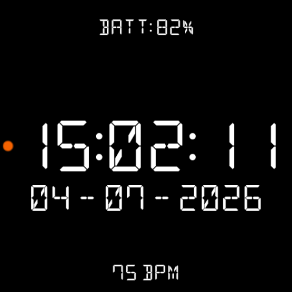

# SEG-14

A minimalist digital watch face for **Wear OS** that renders the time in a
14-segment LCD font (DSEG14), complete with faint "ghost" segments for that
authentic segmented-display look. Built entirely with the declarative
[Watch Face Format (WFF)](https://developer.android.com/training/wearables/wff) —
no runtime code.

<p align="center">
  
</p>

## Features

All options are configurable on-device via the watch face editor (see below).

- **24-hour time** in the DSEG14 Classic segmented font.
- **Time display modes:** show seconds (`HH:MM:SS`), blinking colon, or static colon.
- **Ghost segments:** full 14-segment, classic 7-segment, or off — a faint,
  color-matched "unlit segments" layer behind the time.
- **Color themes:** white, red, amber, green, cyan, blue.
- **Complications**, each with its own on/off toggle:
  - **Battery** — `BATT: 82%` above the time.
  - **Date** — `DD - MM - YYYY` below the time.
  - **Heart rate** — `75 bpm` at the bottom (off by default).
- **Always-on display:** a dimmed, minimal `HH:MM` in ambient mode. In seconds
  mode the hours and minutes stay put and the seconds simply drop off until you
  raise your wrist.

## Requirements

- A Wear OS 5+ watch or emulator (the face declares Watch Face Format **version 2**).
- `minSdk 34`, `targetSdk 36`.

## Build & install

```bash
# Build the debug APK
./gradlew :watchface:assembleDebug

# Install to a connected watch or emulator
adb install -r watchface/build/outputs/apk/debug/watchface-debug.apk
```

Or open the project in Android Studio and run the `watchface` configuration on
your device/emulator.

## Customizing

After installing, set the watch face, then **long-press the watch face** and tap
the **✏️ (Customize)** button to change the ghost style, time mode, color, and
which complications are shown. (On Samsung One UI Watch the options are shown as
a live preview you swipe through; on Pixel/AOSP they appear as labelled items.)

## How it works

This is a resource-only app (`android:hasCode="false"`). The entire watch face is
defined in [`watchface/src/main/res/raw/watchface.xml`](watchface/src/main/res/raw/watchface.xml):

- `UserConfigurations` declares the editor settings (list, color and boolean options).
- `Condition` blocks switch layout based on the chosen options.
- Time/date/battery/heart-rate values come from WFF data sources
  (`[HOUR_0_23]`, `[MINUTE]`, `[SECOND]`, `[DAY]`, `[MONTH]`, `[YEAR]`,
  `[BATTERY_PERCENT]`, `[HEART_RATE]`).
- `<Editable value="true"/>` in
  [`watch_face_info.xml`](watchface/src/main/res/xml/watch_face_info.xml) is what
  makes the Customize button appear.

## Credits

- Font: [**DSEG**](https://github.com/keshikan/DSEG) by Keshikan, licensed under
  the SIL Open Font License 1.1.
